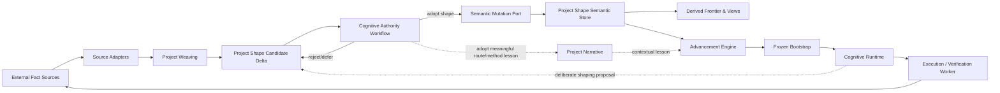

# Architecture Spine — Battle Map

## Design Paradigm

Battle Map uses a **hexagonal architecture** around a **Project Shape Semantic Store**. The semantic core owns durable project shape; external fact sources and execution runtimes connect through replaceable ports/adapters. Project Weaving is the semantic-ingress pipeline. Advancement is a policy-driven read/decide/dispatch service.
## Invariants & Rules

### AD-1 — [ADOPTED] Project Shape is the durable semantic authority
- **Binds:** all
- **Prevents:** Battle Map drifting into a fact archive, evidence warehouse, or mirror of external artifacts.
- **Rule:** Durable project cognition is expressed as minimal node semantics plus first-class project relations and small current validity/unknown/advancement boundaries. Raw execution facts are never the canonical project semantics.

### AD-2 — [ADOPTED] Map, Narrative, and temporary facts are separate responsibility classes
- **Binds:** Project Shape, Project Narrative, Project Weaving, adapters
- **Prevents:** Narrative becoming a replay log and Project Shape becoming an archaeological record.
- **Rule:** Battle Map preserves current shape and route structure. Project Narrative preserves only route/method/process lessons worth reusing, including lessons that do not require a Project Shape change. Raw facts remain in external sources or a non-canonical temporary workset used only for current reasoning.

### AD-3 — [ADOPTED] Weaving is the only raw-reality semantic ingress
- **Binds:** Project Weaving, adapters, Project Shape
- **Prevents:** logs, tests, diffs, tool calls, or other source events directly mutating durable project semantics.
- **Rule:** External changes must pass through incremental reading and semantic distillation before they may become relation, boundary, or lesson candidates. Undistilled facts cannot write adopted Project Shape.
### AD-4 — [ADOPTED] Shape adoption has one semantic-version consistency boundary
- **Binds:** every adopted structural mutation and every derived projection
- **Prevents:** partially applied topology or a dispatch mixing Project Shape from one semantic version with frontier/views derived from another.
- **Rule:** An adopted change that alters Project Shape creates one coherent semantic version. Derived frontier, route availability, and other projections must identify and resolve against their source semantic version; readers may not combine versions in one decision/bootstrap.

### AD-5 — [ADOPTED] Advancement reads and dispatches; it does not discover structure
- **Binds:** Advancement / Command Engine
- **Prevents:** orchestration silently rewriting project meaning or changing a worker's world while it is executing.
- **Rule:** Advancement reads one coherent Project Shape view, selects the next action class, resolves the required cognitive responsibility, and compiles a frozen bootstrap. It cannot derive structural candidates from raw facts and cannot inject new project decisions into a running worker.

### AD-6 — [ADOPTED] Cognitive responsibility is composable and version-bound
- **Binds:** Cognitive Runtime, bootstrap compilation, sessions
- **Prevents:** hard-coded job rosters, implicit authority, role drift, and unrecoverable session behavior.
- **Rule:** A runtime responsibility is composed from Persona + Authority + Skill bundle + Workflow protocol + Handoff contract + Session binding. Reusable definitions are versioned independently; each bootstrap binds the exact definitions used.
- **Enforcement boundary:** Persona carries continuous cognitive identity; Skill bundle supplies composable capabilities; Workflow protocol defines the current cognitive procedure. None of these prompt-level layers is trusted as a hard enforcement mechanism. Any requirement whose violation must prevent advancement — state transitions, authority limits, canonical write paths, artifact/schema validity, deterministic verification gates, or required handoff fields — is checked or enforced by the deterministic control plane outside the worker's discretionary reasoning.
- **Evidence:** Standard BMAD agent definitions intentionally carry persona across subsequently invoked skills, while the project's real Brief/PRD runs showed workflow instructions can still be read yet violated under artifact-completion pressure even when no Mary/John persona was active. This separates identity continuity from protocol compliance rather than treating one as a fix for the other.
### AD-7 — [ADOPTED] Workers cannot mutate durable project semantics directly
- **Binds:** execution and verification runtimes, worker adapters
- **Prevents:** local implementation state, tool history, or model judgment bypassing project-level cognition and authority.
- **Rule:** Workers execute only within their frozen bootstrap and native runtime. Worker-local plans, tool calls, and raw outcomes stay local or external. Meaningful outcomes return through Weaving. Independent verification crosses a genuine cognitive-responsibility boundary.

### AD-8 — [ADOPTED] Frontier and specialized views are derived, never authoritative
- **Binds:** frontier, route availability, UI projections, graph/search indexes
- **Prevents:** duplicated state ownership and hand-maintained views diverging from Project Shape.
- **Rule:** Frontier and route availability are derived from current relations plus satisfied, unknown, and blocking boundaries. UI views and specialized graph/text/semantic indexes are rebuildable projections and cannot become competing semantic authorities.

### AD-9 — [ADOPTED] Compatibility providers never define Battle Map ontology
- **Binds:** all source adapters and brownfield compatibility paths
- **Prevents:** BMAD or any other provider re-shaping the native system around its roles, phases, files, or vocabulary.
- **Rule:** External systems retain authority over their raw facts and may provide compatibility inputs/outputs, but Project Shape remains Battle-Map-native. Provider-specific concepts may appear only inside adapters and compatibility mappings.

### AD-10 — [ADOPTED] One candidate contract and one canonical mutation port
- **Binds:** Weaving, cognitive shaping, authority workflows, Project Shape persistence
- **Prevents:** different responsibilities proposing incompatible change formats or independently writing competing versions of Project Shape.
- **Rule:** Every semantic-candidate producer emits the same Battle-Map-native Project Shape Candidate Delta contract. Owning authority returns a decision against that contract. Only the Semantic Mutation Port may commit adopted Project Shape; every other component is read-only with respect to adopted shape.

## Structural Seed

Dependency direction is inward toward Battle Map semantics: adapters and workers depend on Battle Map ports/contracts; the semantic core never depends on a specific source system, harness, database product, UI framework, or external method.
## Consistency Conventions

| Concern | Convention |
| --- | --- |
| Canonical semantic write path | Any semantic producer → one Project Shape Candidate Delta → owning authority → one Semantic Mutation Port → adopted Project Shape |
| Runtime context | Every dispatched action receives one frozen bootstrap compiled from one Project Shape semantic version and only projections bound to that version |
| Long-lived project memory | Preserve shape, relations, current boundaries, and reusable route/method/process lessons; do not preserve raw execution detail as project semantics |
| Provider integration | Provider-specific vocabulary and storage stay behind adapters; no provider defines Battle Map ontology |
| Derived data | Frontier, route availability, UI views, and specialized indexes must be reproducible from canonical Project Shape plus current boundaries |

## Capability → Architecture Map

| Capability / Area | Lives in | Governed by |
| --- | --- | --- |
| Project Map / current shape | Project Shape Semantic Store + derived views | AD-1, AD-4, AD-8 |
| Project Weaving / auto-association | Weaving application pipeline | AD-2, AD-3, AD-10 |
| Project Narrative / lessons | Project Narrative responsibility | AD-2 |
| Advancement / next move | Advancement service | AD-5, AD-8 |
| Persona / Authority / Skill / Workflow / Handoff / Session | Cognitive Runtime | AD-6, AD-10 |
| Construction / independent verification | Worker runtimes behind ports | AD-7 |
| Harness / Git / tests / reviews / external methods | Source adapters | AD-3, AD-9 |
## Deferred

- **Physical semantic-store carrier.** Choose embedded vs service database, graph acceleration, and indexing only after observing real data shape, access patterns, deployment constraints, and recovery needs. The carrier must preserve AD-1/AD-4 semantics.
- **Deployment and multi-device topology.** Local-only, synchronized multi-device, and service-hosted forms remain open until there is a real collaboration/deployment requirement. No sync or conflict algorithm is implied by this spine.
- **Temporary fact-workset lifecycle.** The architecture only requires that raw facts are non-canonical and cannot silently accumulate as durable project semantics. Retention/cleanup mechanics belong to implementation and source-system constraints.
- **Authority-policy representation.** Product-definition, structural-constraint, execution-contract, and region/gate-closure authority scopes are architectural concepts; their configuration format and delegation policy remain open.
- **Projection technology.** UI framework, graph traversal engine, full-text/vector indexes, caching, and materialized-view strategy are replaceable optimizations behind AD-8.
- **Operational envelope.** Monitoring, backup/recovery automation, deployment packaging, secrets/authentication, and source-adapter rollout order require implementation evidence and environment decisions; they may not redefine the semantic core.
- **Cross-project lesson reuse.** Whether Project Narrative lessons become a global reusable knowledge base remains open. A future mechanism must preserve AD-2 and must not turn lessons back into raw historical archives.

## Internal Compatibility Boundary

Standard BMAD / BMAD Loop may supply role-persona patterns, skill/workflow protocols, durable handoff mechanics, independent-review patterns, and deterministic control-loop ideas through compatibility adapters. Their named roles, phases, file tree, and scheduling ontology do not bind Battle Map's native architecture.